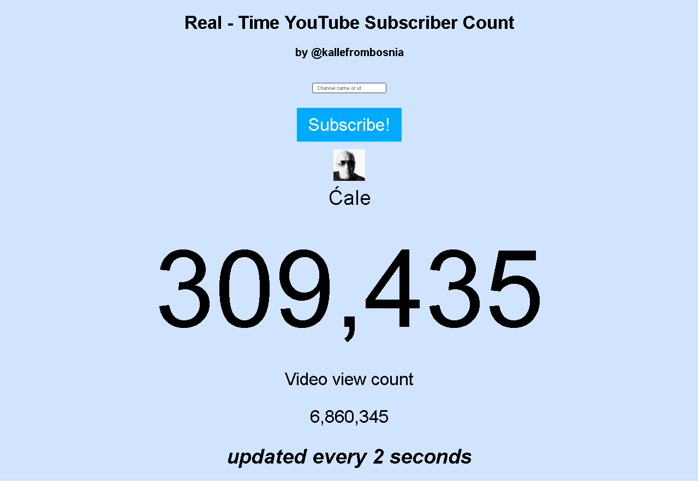

# YouTube Realtime

This is a simple experiment which shows the current live subscriber count on YouTube for a user. The count displayed on YouTube is often incorrect because it doesn't update in real time. The count used on this experiment is taken directly from the API.

 
*YouTube Realtime showing Ćale channel info*

Feel free to submit issues/pull request if you'd like to contribute.

# Features

* Realtime Subscriber Count
* Easy channel selection
* Shows total video views of the user
* Easy Sharing built in
* Simple custom URLs

# Disclaimer

Use at own risk. Didnt tested in production!
